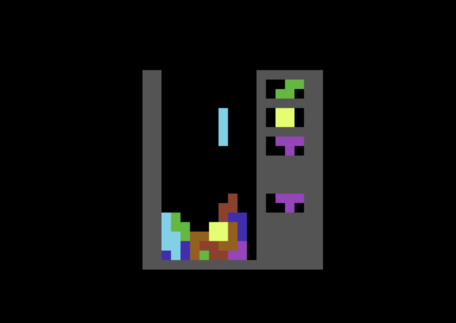
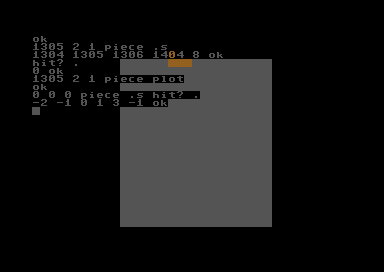
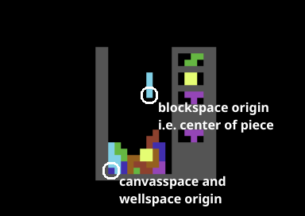
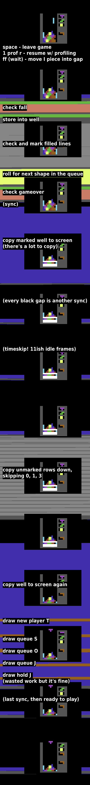

<!-- markdownlint-disable blanks-around-headings ol-prefix no-inline-html table-column-style -->

# SSS: The Silent Soviet Stacker
[##0]: #sss-the-silent-soviet-stacker

A block-stacking game written in the number-stacking language
Forth, for the Commodore 64. Pause a game in progress then
tinker with the live game state in the interpreter.

- [README][rea]: Jump in and play.
- **Design Tour (here)**: Understand the code.
- [Tinkering][tin]: Make your own dev environment.
- [Forth source][sss]: Damn dense, beware dragons.



## This Document
<!------------->

<!-- TOC for raw readers: $ grep -n '^#' Design.md -->
Github readers, click the outline button on the top right.
To skip the background fluff, jump to [›Architecture][#1a],
or [›Comment Convention][#1c] which leads into:

- [›Diving In][##2] to core design, then:
- Two whirlwind tours: [›Game Stuff][##3], [›Dev Stuff][##4].
- Finally, [›Performance and Tradeoffs][##5] rationale.

### Intended Audience

SSS is written in [Forth][for], an old and grumpy language I
adore. This text is for the Forth-curious: you've toyed
around, don't need the stack explained _yet again,_ but
haven't written much substance. I link references throughout
for many gory details. Lemme know if something's still
particularly muddy or you can think of more or better links!

- Platform: Joe Forster's [essential C64 docs][joe],
  the [C64 wiki][c64], [Easy 6502][eas], [6502.org][650].
  If details below intimidate you, try to move past.
  The interesting stuff is the game, so:
- A walk through the [Tetris wiki][tet] can't hurt!
- If the above _doesn't_ describe you and you _do_ need stacks
  explained to you, [Starting Forth][sta] is your next step.
  Grab your favorite C64 emulator and a [durexForth cart][car]
  and follow along the examples.
- Refer to the [durexForth manual][dfm] and the
  [ANS Forth glossary][glo] which is thorough but opaque.

### Background

I feel like hobby coders like me are drawn to Forth. I've been
interested for some years. Mostly I noodled with gforth via
online compilers like ideone.

I'm a big fan of [8-Bit Show and Tell][8bs]; Robin's such a
charming presenter. A comment on his [64Forth episode][8bf]
led me to durexForth in early 2023 and got my hands on a C64
emulator for the first time. Lots of fun!

In December 2024 I saw someone on 4chan /g/ writing a Tetris
in 6502 so I tried my hand at writing one myself. I start
Tetrises sometimes but don't usually get far. This one came
together mostly fully-formed in a week or two and I've been
picking at it to relax ever since.

I only _later_ realized that the C64 hosted the
[_very first_ commercial Tetris][mir] way back in 1988, after
a couple noncommercial ones. You _need_ to listen to Mr.
Wally Beben's [sprawling 26-minute opus][beb] if you haven't!

See the README for [full mission statement][thi], but in short
this is my code garden. A working, nontrivial Forth program,
plus documentation to make it an example.

### Spec

I've played tons of [The Tetris Company (TTC)][ttc] games, I
strongly admire [Tetris The Grandmaster (TGM)][tgm], plus
platform constraints and my own preferences make for an
eclectic mixed spec, mostly TGM-like:

- **Starting**: You're expected to compile SSS at the
  durexForth prompt then type `new` or `r` to play. See
  README to [set up an emulator][rea], and optionally
  Tinkering to [save the source to a disk image][tin].
- **Playfield**: 10x23.
- **Colors**: Guideline (cyan I, purple T, etc).
- **Spawn**: Row 19 (counting from 0), pointy-end-down.
  All pieces [›bias right][#5k].
- **Shift**: S/F keys, with [›mostly 50Hz][##5] [DAS].
- [**›Rotate**][#5r]: J/K keys. Flipped JLT are downshifted to
  lie flat, ISZ have only one vertical.
- [**›Kicks**][#5k]: Biased towards rotation. Tries sides then
  below then below sides. No 2-kick for I. No floorkicks.
- [**›Drop**][#5g]: D soft, E hard. No lock delay.
  Gravity increases every 8 lines.
- [**Hold**][hol]: L key.
- **Generator**: [›Reroller][#3q] queue. 4 slots,
  4 tries, giving 3 next piece previews.
- [**›Score**][#5p]: None.
- [**Gameover**][out]: Blockout only, exits back to Forth.
  No topout: pieces can't move up.

### Architecture
[#1a]: #architecture

- [**Commodore 64**][c64]: a 6510 computer, a variant
  of 6502. CIA for timers, keyboard. VIC-II for graphics.
  SID for sound ([›unused][#5s]).
- [**Kernal**][ker]: An 8K 6510 program I haven't read.
  Of note: an interrupt service routine that scans the
  key matrix via the CIA and keeps an input buffer.
- [**durexForth**][dur]: A mixed assembly/Forth program
  compiled (v4) to 12.4K* of 6510 code. A
  subroutine-threaded Forth, so it compiles most Forth source
  into `jsr` instructions executed directly. It unloads BASIC
  but calls into Kernal.
- [**SSS**][sss]: A <3K compiled durexForth program.
  - Uses `key` which calls into [Kernal `$e5b4`][e5b].
  - Canvas of reverse-video spaces in VIC-II screen `$400`,
  - Animated by mutating color memory `$d800`.
  - Game state at `$cc00`, outside the dictionary
    to survive recompiles.

\* About 4K of durexForth is an optional vi-clone which I
don't personally use and could delete, so compiled SSS amounts
to about 19K of software on the C64.

### Comment Convention
[#1c]: #comment-convention

Forth subroutines are called "words" and operate on a stack of
values. I use compact stack comments to fit the cramped C64
screen, one letter per stack cell:

- `erase ( au-)` takes an address and unsigned count -> gives
  no result but zeroes the named region of memory.
- `curr ( -pts)` takes no arguments -> fetches piece position,
  turn count, and shape index from game state table.
- `piece ( pts-ppppc)` takes those three values -> gives 4
  block positions and a [color code][col].
- `hit? ( ppppc-f)` takes those five values -> gives a boolean
  flag, so the full phrase `curr piece hit?` does what you'd
  expect.
- `split ( $yyxx -- $xx $yy )` sometimes I lean closer to
  conventional [ANS notation][not] when I think the clarity is
  needed. `$` means hexadecimal.

## Diving In
[##2]: #diving-in
<!--------->

### Example Session
[#2e]: #example-session

The `piece` word is the heart of this program. It computes
block positions from a piece description. Read this
interpreter session closely:

```forth
\ these comments, wider than the screen, added after.
hex bg
ok \ sets up number base and screen canvas.
1305 2 1 piece .s \ row 19($13) col 5 turns 2 shape J(1)
1304 1305 1306 1404 8 ok \ 4 blocks + orange(8) color
hit? .
0 ok \ false = no collision
1305 2 1 piece plot
ok \ paints rotated orange J piece at top of well.
\ though the 1404 above overwrites part of that canvas.
0 0 0 piece .s \ bottom left(0) flat(0) I(0) piece.
-2 -1 0 1 3 ok \ 2/4 blocks out of bounds, cyan(3) color.
hit? .
-1 ok \ out of bounds counts as colliding with the wall.
```



### Coords `(p)`

Packed hex `$yyxx` coordinates exist in three spaces:

- **Blockspace:** `0 <= y <= 3, -2 <= x <= 1` <br>
  `$0000` = piece origin, where line clear check starts.
- **Wellspace `th-w`:** `0 <= y <= 22, 0 <= x <= 9` <br>
  `$0000` = bottom left of playfield of `land`ed blocks.
- **Canvasspace `th-c`:** `0 <= y <= 20, 0 <= x <= 14` <br>
  `$0000` = screen row 22 column 13 near bottom left of main
  21x19 canvas, corresponding to well origin. Hold and next
  queue are on the right `11 <= x <= 14`.



The [›orange value `8` above][#2e] can be `lock`ed into the 4
well positions if not `hit?`-detected, or `plot`ted on screen.
These use memory indexing `n th` words: `0 th-w` for example
gives the address of the **(0,0)th space in the well.**

```forth
0 th-w h. well h.
cc00 cc00 ok
$0405 th-w h. #45 well + h.
cc2d cc2d ok
$0405 th-c h. -4 40* 5 + colormem + h.
dae2 dae2 ok
0 th-q h. 3 th-q h. ( queue head/tail )
ccee cced ok
```

### Data Shorthands `c: b:`

> [!TIP]
> You should probably refer to [the source][sss] in a separate
> tab then Ctrl-F `: n:` to jump to:

```forth
: n: ( *'-*) parse-name evaluate ;
: c: ( u'-) 0 do n: c, loop ;
create colors 7 c: 3 8 6 4 5 2 7
```

`n: (*'-*)` asks the interpreter to parse `'` and interpret a
word. Since it could do literally anything I notate its stack
effect with `*`s but it's intended to parse number literals
for compiling data.

`c: (u'-)` loops `u` times, calling `n:` to parse a value and
`c,` to compile a character (i.e. byte) to memory.

`colors (-a)`, [a `create`d word][arr], pushes the `a`ddress
of a table of 7 [color code][col] bytes. Without the shorthand
I could have just written this as:
`create colors 3 c, 8 c, 6 c, 4 c, 5 c, 2 c, 7 c,`

```forth
: >p ( c-p) dup 4* 4* or $f0f and 2 - ;
: b: ( '-) hex 8 0 do n: >p , loop decimal ;
```

`>p (c-p)` does precomputation: expanding an 8-bit
`c`haracter hex `$yx` into 16-bit `$0y0x`, then `2 -`
[›adjusts the origin][#5r].

`b: ('-)` loops 8 times, parsing, expanding, and compiling hex
literals with `n: >p ,`.

### The `blocks` Table
[#2t]: #the-blocks-table

```forth
create blocks \ origin (x/.) at yx=02:
b: 00 01 02 03  02 12 22 32  \ iixi
b: 00 01 02 03  02 12 22 32
b:  03 11 12 13  01 02 12 22 \    jjj
b:  01 02 03 11  02 12 22 23 \     .j
b: 01 11 12 13  02 12 22 21  \ lll
b: 01 02 03 13  03 02 12 22  \ l.
( 4 shapes omitted. )
```

> [!IMPORTANT]
> The values here have some of the biggest
> [›impact on game-feel][#5r].

`blocks (-a)` gives the `a`ddress of the table. Again I could
have written this without shorthand as below but the goal was
for the data in the source to be compact and easier to read.

```forth
create blocks \ compiled blockspace coords:
-2 , -1 , 0 , 1 , 0 , $100 , $200 , $300 ,
( etc etc )
```

### `piece` Computation

```forth
\ \ zp: w = temp, lsb/msb,x = stack.
\ : w! ( a-) [ lsb ldy,x w sty, msb ldy,x
\   w 1+ sty, inx, 0 ldy,# ] ;
\ : b@ ( p -- p+a@ p ; a+=2.) dup [ clc,
\   w lda,(y) iny, lsb 1+ dup adc,x sta,x
\   w lda,(y) iny, msb 1+ dup adc,x sta,x
\   ] ; \ scan pos from blocks table.
: b@ ( pa-ppa) dup >r @ over + swap r> 2+ ;

\ 7 shapes 4 turns 4 blocks 2 bytes.
: piece ( pts-ppppc) dup >r 4* + 4* 2*
  blocks + ( w! ) b@ b@ b@ b@ 2drop r>
  colors + c@ ;
```

For speed sake the table scan words `w! (a-) b@ (p-pp)` are
written in assembly but for pedagogy sake I present above an
older combined Forth definition of `b@ (pa-ppa)`.

`b@ (pa-ppa)` takes a piece position `p1` `$yyxx`, an address
in the blocks table `a1`, and fetches `@` and adds `+` one
cell of the table giving computed block position `p2`, keeping
the piece position `p3=p1`, and moving to the next table
address `a2=a1+2` ready to fetch the next block.

> [!NOTE]
> The Forth idiom `>r phrase r>` saves a value to the return
> stack, allowing you to apply a `phrase` to the values
> underneath it. Another word, `>10+>`, is named to evoke this
> idiom, though it uses `swap`s for speed.

`piece (pts-ppppc)` takes a piece `p`osition `$yyxx`, `t`urn
count `0-3`, and `s`hape index `0-6`, combines `t` and `s` to
index into the blocks table, calls `b@` to scan out 4
`p`ositions, and then a `c`olor.

Besides the assembly `w! b@`, the rest of the program is Forth
and just fast enough for [›mostly full 50fps][##5] during play.

## Touring the Rest, Part 1: Game Stuff
[##3]: #touring-the-rest-part-1-game-stuff
<!------------------------------------>

### `kbinit`

```forth
: kbinit ( -) $b80 $28a ! 0 $c6 c! ;
: land ( -- gameover? ) kbinit ( ... ) ;
```

`kbinit` stores 3 bytes:

1. `$80` configures the [Kernal][ker] to
   [repeat all keys][rep], not just the cursors.
2. `$b` repeat delay of 11 frames.
3. `0` flushes the [key buffer][buf].

`land` calls it _first,_ before all its other work, to:

4. Prevent a keypress from leaking to the next piece,
5. Allow the player to leak it anyway, holding it through a
   12 frame line clear delay,
6. Permit new buffered keypresses during that same delay.

2+3 and 1 should probably be separate words but I like the
density.

### `new`
[#3n]: #new

```forth
: entropy ( -u) $a1 @ dup 0= + ;
: ?init ( f-) if  well size erase
  enter  99 sig c!  then ;
99 sig c@ <> ?init \ not on redo.
: seeded ( u-) 1 ?init  seed !  5 held!
  4 enqueue 5 enqueue 4 enqueue
  4 roll enqueue  qnext qnext qnext ;
: r ( -) kbinit bg dd
  begin step draw until ;
: new ( -) entropy seeded r ;
```

Starting a `new` game fetches part of the [jiffy clock][jif]
to seed the game state then enters the main loop, which is
named `r` for easy typing by the player.

The `dup 0= +` phrase in `entropy` ensures nonzero seed, which
was important for [an old xorshift PRNG][xor] and harmless
with the current LCG. It's cute and I've grown fond of it.

The initial queue mimics [TGM randomizer][ran] behavior. First
the queue is [S, Z, S, random IJLT], then after flushing
(`qnext` three times), the player starts with IJLT, and the
next 3 pieces are less likely to be S or Z (4 or 5).

IJLT are first in the `blocks` table to enable simple
`4 roll enqueue`. SZ are adjacent because an earlier version
did `2 roll 4 + ( s4-or-z5 ) held!` but I decided to simplify
and also compensate for the init queue having only one Z. Not
very important but that's my rationale anyway.

### `qnext`
[#3q]: #qnext

```forth
\ roll (u-u) 0 <= u2 < u1.
: q? ( si-s/si-) th-q c@ over =
  if drop rdrop then ;
: qn ( -) 7 roll 0 q? 1 q? 2 q? 3 q?
  enqueue r> rdrop >r ;  12 profile
: qnext ( -) qn qn qn 7 roll enqueue ;
```

`qnext` itself reflects the complexity of the TGM algorithm.
It uses `rdrop` for nonlocal returns: if `q?` detects a
duplicate roll it returns to `qnext` to roll again, but if
`qn` passes all four `q?` it queues the successful roll and
returns to `qnext`'s caller, though it must take care to dodge
the [›profiling instrument][#4p].

> [!NOTE]
> `enqueue` is only called once. It's also possible to write
> more conventionally with flags and `if` instead of `rdrop`.
> This isn't critical path so the codesize and cycle savings
> aren't important but I choose to spend the extra `rdrop`
> cognitive load just for its aesthetic, which I'm fond of.

### `go` and `turnkick`

```forth
\ macro: ;then = exit then
: t@+ ( t-t) turns c@ + 3 and ;
: curr+ ( pt-pts) swap pos @ +
  swap t@+  shape c@ ;
: curr+! ( pt-) t@+ turns c!  pos +! ;
$-100 constant down
: go ( pt-f) 2dup curr+ piece hit?
  if 2drop 1 ;then  curr+! #go d! 0 ;
: tk ( pt-) go 0= if rdrop rdrop then ;
: turnkick ( t-) >r  0 r@ tk  r@ r@ tk
  0 r@ - r@ tk  down r@ tk  down r@ +
  r@ tk  down r@ - r@ tk  rdrop ;
```

`go` adds `p`osition and `t`urn offsets to the current player
variables `pos` and `turns`, hit-checks the new hypothetical
piece position, and updates those variables if the piece can
move there. `turnkick` calls it up to six times to implement
[wallkicking][wal] upon rotation.

> [!NOTE]
> A vertical I-piece against the left wall _cannot kick._ I
> chose to keep the code simple without an exception for it.
> I suspect most players will never notice.
>
> [›No floorkicks][#5k], either.

## Touring the Rest, Part 2: Dev Stuff
[##4]: #touring-the-rest-part-2-dev-stuff
<!----------------------------------->



### `profile`
[#4p]: #profile

```forth
create bx  $d020 eor, $d020 sta, rts,
: profile ( color -- ) here >r  dup
  lda,# bx jsr, latest >xt jsr, lda,#
  bx jmp,  r> latest name>string + ! ;
: '' ( "name" -- xt ) ' 6 + @ ;
: prof ( enable-time-profiling? -- )
  if $4d else $60 then bx c! ;
```

The code at `bx` ("border xor") toggles the
[C64 border color register][bor] at `$d020`.
`profile` adjusts the latest word to point to new code:
`lda #color | jsr bx | jsr oldcode | lda #color | jmp bx`,
instrumenting the word with border-flipping behavior to
[›measure perf][##5]. The phrase `name>string +` addresses
the code field stored after the name.

`''` ticks through an instrumented word, recovering the
`oldcode` [execution token][exe] from the `jsr` instruction.
For `dump`ing or `execute`ing or whatever. Example: `'' sync
1+ c@ .` prints the `215` operand from `sync`'s `lda,#`
instruction below.

`0 prof` patches the first instruction at `bx` to an `rts`,
disabling it. `1 prof` restores the `eor`.

### `sync` and `bg`
[#4s]: #sync-and-bg

```forth
: sync ( -) [ 215 lda,# $d012 cmp,
  -5 bne, ] ;  6 profile
: draw ( -) sync ( ... ) ;  6 profile
```

The `6 profile` here temporarily **undoes** the `6 profile` of
`draw`, returning to black border while waiting for sync.
Raster line 215 is near the bottom of the well so most `draw`
updates happen right after the scanline passes. Tradeoffs:

1. Hard code `215` as above: correct by construction.
2. Parameterize on 8-bit input:
   incorrect for lines 0-54 and 256-311.
3. Parameterize on 9-bit input: more argument and loop code.
4. Actually learn raster interrupts: I don't wanna.

```forth
: rect ( awh-a) 0 do  2dup $a0 ( rvbl )
  fill  swap 40- swap loop  drop ;
: bg ( -) 0 $d020 ( black bg+border ) !
  11 $286 ( gray fg ) c! page tilemem
  38 + 19 21 rect 2+ #10 3 rect drop ;
```

The reverse-video spaces `$a0` make pleasant squares and also
are ignored by the interpreter to make testing and
experimenting easier. Above the main 21x19 canvas is an extra
3x10 area for pieces to rotate into, usually invisible because
the empty well is painted onto it.

### `redo`

```forth
marker --sss--
: redo ( -) --sss-- s" sss.fs"
  included ( must tco! safe w/ df. ) ;
```

`redo` is a deeply magical development convenience.

Consider what happens when you type `redo` at the interpreter.
It executes the marker `--sss--`, deleting the program,
including `redo` itself. The processor doesn't care, it
continues executing the code, now in free memory, pushing the
`( addr len )` of the file name and then calling `included`,
which recompiles the source.

In most Forths, execution would then try to return from
`included` back to `redo` code that might have moved, crashing
the system in a fireball. durexForth, however, optimizes the
tail-call into a jump, so `included` returns directly to the
interpreter safely.

You can then **resume a game in progress with the new code**
since the variables are outside the dictionary at `$cc00`,
chosen to overlap unused hi-res graphics, just after `v`'s
buffer.

One consideration: invalid positions etc. in uninitialized
game state will corrupt memory when trying to draw, so
init [›tracks a `sig`nature][#3n] to prevent this.

### `10 value #10`

A durexForth literal `: example $1234 ;` compiles to 5 bytes
of code: `jsr lit | !word $1234` and the [`lit` routine][lit]
takes 18 instructions to juggle stacks and fetch the value.
However, a phrase `$1234 value example` compiles 7 bytes:
`lda #$12 | ldy #$34 | jmp pushya` where [`pushya`][pya] takes
only 4 instructions, then a 3-byte `jsr` on each use, both
faster and potentially smaller. I define words `#10` and `4`
since those are used pretty often.

### Optional Tools `recent`, `bench`, `patch:`

[`recent`][rec] checks the cursor column variable `$d3` for
word wrap and uses [`dowords`][wor] to look through the
dictionary.

[`bench`][ben] is based on [durexForth's `timer`][tim], except
with a builtin loop to measure much smaller cycle counts, and
calling its clock fetcher `now` to avoid the `start` name
clash. Of note, the second `ti` modifies the code of the first
`ti`, keeping a stable stack depth for each jump to the target
xt.

[`patch:`][pat] I only just now came up with and so haven't
exercised yet! Beyond the single given example. Heed the
warning, it's a very sharp tool, but any word that calls
(`jsr`s) most any other word will be safe to patch. The
example unsafe word `: bad drop ;` only compiles to 2 bytes
`inx | rts`. Another is `: nop ;` which is only an `rts`.
I think these are the only unpatchable cases.

## Performance and Tradeoffs
[##5]: #performance-and-tradeoffs
<!------------------------->

The PAL C64 has a ~19,700 cycle budget per 50Hz frame. Cycle
costs, eyeballing [›`1 prof` color bands][#4p]:

| Frame% | While a Piece is in Play |
|--------|--------------------------|
| 0-7%   | Kernal [interrupt][int]. Rolls through the frame, stepping on `sync` and dropping 1 frame every 4 or 5. |
| 17-19% | `piece hit?` move/gameover check. |
| 13%    | idle `draw step`, tons of margin. |
| 95%    | busy `draw step`, holding `j` to rotate every frame. |

Rotation wallkicks check up to 5 extra moves so might eat a
second or third frame.

| Frame%   | After Landing a Piece |
|----------|-----------------------|
| 150-250% | `land`, depending on how much of the well `mark` scans and how many times `qnext` re-rolls. Then one of: |
| 105%     | `#next d! draw` if no lines, or: |
| 140%     | `#well d! draw` to show marked lines, then 11 idle `%stop` frames, then: |
| 160%     | `sweep` to erase marked lines and: |
| 260%     | `#all d! draw` |

Table 2 is less confident, +/- maybe 10%. I might be able to
spread work across frames to reduce well and queue flicker but
the complexity isn't worth it.

More tradeoffs, ordered by player impact:

### Input

The SDF JKL layout keeps my fingers on home row, ready to type
Forth. I _need_ configurability in games I _play,_ but I
choose not to add it to code whose purpose is to _bring me
joy._

An option, though, is to edit `step` yourself and recompile.
Search [C64 control codes][con] for "cursor" etc.

A wilder option is to live-patch the code in memory:

```forth
'' step dump \ durexforth dumps 64 bytes of machine code.
\ I search the character listing on the right for 's'.
n \ dump 64 more, then I see the 's' at addr $43f3, ymmv.
'z' $43f3 c! \ now 'z' is the shift-left key!
r \ it's pretty hard to play!
's' $43f3 c! \ so I put it back.
```

> [!WARNING]
> Obviously not for the faint-of-heart. A bad patch will crash
> the program, but it saves a recompile! I do this kind of thing
> sometimes while developing, it's how I determined the
> [›`215` rasterline][#4s] above.

### Sound
[#5s]: #sound

I've never done sound programming before. The SID looks neat,
though I wonder if the extra code might strain the already
cramped margins. I also enjoy the aesthetic of very little
6502 code. Maybe I'm worrying too much.

The silence, it strikes a certain Soviet charm, no?

I again recommend listening to [Mr. Beben's composition][beb]
for the [1988 Mirrorsoft Tetris][mir]. Sets a hell of a mood.

### Ghost and Sonic Drop
[#5g]: #ghost-and-sonic-drop

Implementing the [ghost piece][gho] in a perfomant way is
subtle. Probably I'd check one row per frame, adding some
complexity, to say nothing of drawing. I've seen NES
block-stackers with the feature but the complexity cost
probably outspends my joy budget.

Ghost calculation is necessary for [instant drop][dro] which I
value enough to just do all at once on input, usually taking
several frames. Hard drop locks the piece instantly, and sonic
drop doesn't, allowing for more player agency at the cost of
more inputs in the usual case. Both are valid player actions
but sonic requires more subtle code for good game feel: you
want lock delay, plus you _don't_ want to accidentally buffer
a sonic drop between pieces.

I just went with hard drop, I'm more used to it anyway. Might
revisit.

### Lock Delay

I'm very fond of [lock delay][del], though I haven't given a
huge amount of thought to implementing it. My intuition tells
me it's not very simple.

### Rotation
[#5r]: #rotation

The positions encoded in the [›`blocks` table][#2t] are the
larger part of a game's "[Rotation System][rot]" and have
large impact on game-feel, but it's perhaps only noticeable to
veteran players. SSS uses neither TTC's [SRS] nor TGM's [ARS].

```forth
: >p ( ... ) 2 - ;
: b: ( ... ) n: >p , ( ... ) ;

create blocks
( ... )
b: 01 11 12 13
( ... )

\ 3 | . . . .    L-piece, pointed down
\ 2 | . . . .    in spawn orientation.
\ 1 | .[][][]
\ 0 | .[] o . <- origin
\    --------
\    -2-1 0 1 <- blockspace x
\     0 1 2 3 <- table source x

: row ( compute from current piece origin ) ;
: mark ( overwrite filled lines in wellspace ) ;
: land ( ... ) row mark ( ... ) ;
```

Negative x in the table borrows from the y coord but when
re-added to the piece position and `hit?` checked, the final
block coords must be in-bounds, preventing memory corruption.
To save a few cycles and a few words of code, `mark` is
coupled to piece origin, which must then be surrounded or
overlapped by blocks, thus the `2 -` adjustment.

This ripples into:

#### Spawn, Kicks
[#5k]: #spawn-kicks

<details><summary><strong>
Expand for the complete `blocks` table:
</strong></summary>

```txt
spawn in well:         rotate clockwise:

|    I0 . . . .      | I1 . .[] . I2 I3 repeat
|       . . . .      |    . .[] .
|       . . . .      |    . .[] .
| . . .[][]()[] . . .|    . .() .

|    J0 . . . .      | J1 . . . . J2 . . . . J3 . . . .
|       . . . .      |    . .[] .    . . . .    . .[][]
|       .[][][]      |    . .[] .    .[] . .    . .[] .
| . . . . . o[] . . .|    .[]() .    .[]()[]    . .() .

|    L0 . . . .      | L1 . . . . L2 . . . . L3 . . . .
|       . . . .      |    .[][] .    . . . .    . .[] .
|       .[][][]      |    . .[] .    . . .[]    . .[] .
| . . . .[] o . . . .|    . .() .    .[]()[]    . .()[]

|    T0 . . . .      | T1 . . . . T2 . . . . T3 . . . .
|       . . . .      |    . .[] .    . . . .    . .[] .
|       .[][][]      |    .[][] .    . .[] .    . .[][]
| . . . . .() . . . .|    . .() .    .[]()[]    . .() .

|    S0 . . . .      | S1 . . . . S2 S3 repeat
|       . . . .      |    .[] . .
|       . .[][]      |    .[][] .
| . . . .[]() . . . .|    . .() .

|    Z0 . . . .      | Z1 . . . . Z2 Z3 repeat
|       . . . .      |    . . .[]
|       .[][] .      |    . .[][]
| . . . . .()[] . . .|    . .() .

|    O0 . . . .      | O1 O2 O3 repeat
|       . . . .      |
|       .[][] .      |
| . . . .[]() . . . .|
```

</details>

In [ARS] the I piece biases to the right, closer to the where
players usually [gap]. In both ARS and [SRS] the 3-wide pieces
JLTSZ, however, bias to the left. I chose to uniformly bias
right, which is simpler, though it clashes with veteran player
muscle memory.

The spawn orientation 0 is pointy-end down and J2 L2 T2 are
downshifted to lie flat, consistent with [ARS] and opposed to
[SRS]. Unlike both, I0 I2 _also_ rest on row 0, obviating much
of the need for [floorkicking][flo], which is unimplemented.

### Score
[#5p]: #score

`lines` count progresses through the gravity frames table but
no scoring beyond that. The performance cost of computing
digits, the complexity cost of BCD, the digits on-screen
interfering with interpreter experimentation, just thinking
about it doesn't spark joy in me.

If you're curious, try `lines @ .` at the prompt. Forth wants
you to explore it! Makes for an awful Tetris product though.

### Density

The source text is constrained to 39 columns to fit on the C64
screen, and for much of development was also within 256 lines.
A constraint I loved and whose loss (around the time I
expanded the big section 5 comment) I lament.

---

[›Back to top][##0]. Some next steps: get your hands
dirty with the source or give this thing a play finally.
Happy stacking, comrade!

<!-- crosslinks -->
[rea]: README.md
[thi]: README.md#this-thing
[tin]: Tinkering.md
[sss]: sss.fs
[rec]: recent.fs
[ben]: bench.fs
[pat]: patch.fs

<!-- tetris -->
[tet]: https://tetris.wiki/
[ars]: https://tetris.wiki/Arika_Rotation_System
[rot]: https://tetris.wiki/Category:Rotation_systems
[das]: https://tetris.wiki/DAS
[dro]: https://tetris.wiki/Drop
[flo]: https://tetris.wiki/Floor_kick
[gho]: https://tetris.wiki/Ghost_piece
[hol]: https://tetris.wiki/Hold_piece
[del]: https://tetris.wiki/Lock_delay
[gap]: https://tetris.wiki/Stacking_for_Tetrises
[srs]: https://tetris.wiki/Super_Rotation_System
[mir]: https://tetris.wiki/Tetris_(Mirrorsoft)
[tgm]: https://tetris.wiki/Tetris_The_Grand_Master_(series)
[ran]: https://tetris.wiki/TGM_randomizer
[ttc]: https://tetris.wiki/The_Tetris_Company
[out]: https://tetris.wiki/Top_out
[wal]: https://tetris.wiki/Wall_kick
[beb]: https://youtu.be/Ny743c32gPg

<!-- forth -->
[for]: https://en.wikipedia.org/wiki/Forth_(programming_language)
[not]: https://forth-standard.org/standard/notation#subsection.2.2.2
[glo]: https://forth-standard.org/standard/alpha
[dur]: https://github.com/jkotlinski/durexforth
[lit]: https://github.com/jkotlinski/durexforth/blob/93e68ac1054d47f4fc018bcf1fe556b3a53fa963/asm/compiler.asm#L195-L219
[pya]: https://github.com/jkotlinski/durexforth/blob/93e68ac1054d47f4fc018bcf1fe556b3a53fa963/asm/durexforth.asm#L117-L122
[tim]: https://github.com/jkotlinski/durexforth/blob/master/forth/timer.fs
[car]: https://github.com/jkotlinski/durexforth/releases
[dfm]: https://jkotlinski.github.io/durexforth/
[wor]: https://jkotlinski.github.io/durexforth/#_word_list
[sta]: https://www.forth.com/starting-forth/
[arr]: https://www.forth.com/starting-forth/8-variables-constants-arrays/#Initializing_an_Array
[exe]: https://www.forth.com/starting-forth/9-forth-execution/

<!-- c64 -->
[650]: https://6502.org
[xor]: https://github.com/impomatic/xorshift798
[eas]: https://skilldrick.github.io/easy6502/
[joe]: https://sta.c64.org/cbmdocs.html
[e5b]: https://sta.c64.org/cbm64kbdfunc.html
[jif]: https://www.c64-wiki.com/wiki/160-162
[buf]: https://www.c64-wiki.com/wiki/198
[bor]: https://www.c64-wiki.com/wiki/53280
[rep]: https://www.c64-wiki.com/wiki/650
[c64]: https://www.c64-wiki.com/wiki/C64
[col]: https://www.c64-wiki.com/wiki/Color
[con]: https://www.c64-wiki.com/wiki/control_character
[int]: https://www.c64-wiki.com/wiki/Interrupt
[ker]: https://www.c64-wiki.com/wiki/Kernal
[8bs]: https://www.youtube.com/@8_Bit
[8bf]: https://youtu.be/1XdgUK1NbpI

<!-- end of Design.md -->
