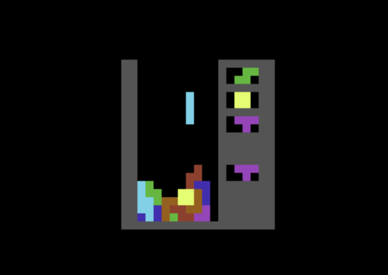

# SSS: The Silent Soviet Stacker

A block-stacking game for the Commodore 64 written in the
number-stacking language Forth.

<table><tr><td align="center">
  <a href="DESIGN.md">
   
  Explore the design</a>
</td><td align="center">
  <a href="TINKERING.md">
   
  Start tinkering</a>
</td></tr></table>

## Try It Out

1. Get the [durexForth][dur] cart or disk.
   [SSS is developed in v4][hfs] but sometimes I also test v5.
2. Load into [VICE][vic].
3. Paste [`sss.fs`][sss] contents.
4. Type `help` then `new`.

> [!WARNING]
> [No sound][sou], no high scores, no menus, and unconventional
> controls. This is a programmer's toybox first, a game second.

### Keys

- **S D F** - Shift left, soft drop, shift right.
- **J K** - Rotate left and right.
- **L** - Exchange piece with hold slot on bottom right.
- Anything else - Pause game and return to Forth.

My own strong preference. See [input rationale][inp] for a(n
admittedly not easy) reconfiguration option.

## This thing:

- **Is a personal project** optimized strictly for **my own
  joy,** which means among other thigns a 50fps target with as
  little assembly code as necessary, because Forth is fun!
- **Explores creative constraints.** durexForth is
  _fast,_ but not as fast as hand-rolled 6502. Arbitrary
  [source text constraints][den], too. They're my muse.
- **Wants to be [tinkered with][tin],** so:
- **Might motivate the Forth- or C64-curious,** but:
- **Is NOT a Tetris product!** No sound, no menus, weird keys.
  General audiences will balk, but I play until Game Over to
  pass the time.
- **Is basically complete.** I'm married to my tradeoffs but
  still poke when fancy strikes. Maybe you can show me an
  angle I hadn't considered though? Would love to make it
  _even denser_ somehow!

<!--
I see you there, reading the raw markdown source. Yeah, TTC
are touchy about their mark, so ya gotta be real careful when
you say "Tetris." We all know this. It's better left unsaid.

But I do mean it earnestly as well: this thing doesn't try to
be a slick product anyone would want to play. It's my toybox.
Come, play with me.
-->

## Further Reading

- The how-to takes you [from player to tinkerer][tin].
- The [design rundown][des] is my bucket document: a mix of
  tutorial (how), background (why), and reference (what). I
  hope you'll indulge my sloppiness and dig for what you need.
- The [Forth source][sss] is damn dense, as its intended
  audience is just myself. For the adventurous!

[rea]: README.md
[tin]: TINKERING.md
[des]: DESIGN.md
[sss]: sss.fs

[dur]: https://github.com/jkotlinski/durexforth
[vic]: https://vice-emu.sourceforge.io/
[hfs]: TINKERING.md#getting-more-leverage
[inp]: DESIGN.md#input
[sou]: DESIGN.md#sound
[den]: DESIGN.md#density

<!-- end of README.md -->

