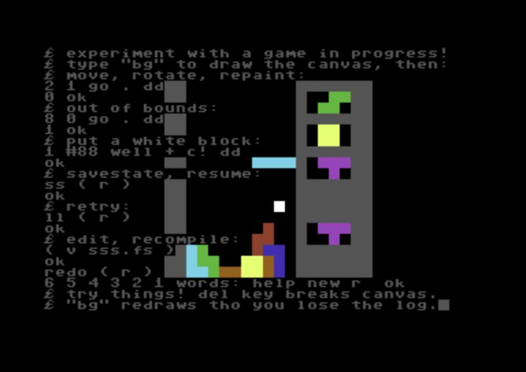

SSS: The Silent Soviet Stacker
==============================

- See the README to [jump in and play][rea].
- **This hands-on guide** takes you from player to tinkerer.
- The [design rundown][des] is my bucket document: a mix of
  tutorial (how), background (why), and reference (what). I
  hope you'll indulge my sloppiness and dig for what you need.
- The [Forth source][sss] is damn dense, as its intended
  audience is just myself. For the adventurous!



Grabbing a Wrench
-----------------

First load the [durexForth][dur] cart or disk into
[VICE][vic]. Then you'll want the source in a disk file.
You can reuse the durexForth disk or attach a new blank disk
from the VICE File menu. Typical VICE config has Alt-Insert to
paste and `~` for the C64 `←` key:

```forth
8 device   \ or 9, to select disk drive. 8 is default
v sss.fs   \ open durexForth vi-clone editor
i<alt-insert>~ZZ  \ paste and save file, return to Forth
include sss.fs    \ compile program. ~30 seconds, so:
<alt-w>    \ VICE warp speed, and again to turn off
help       \ learn the keys
new        \ play a bit, press space to pause
bg dd      \ clear screen, draw canvas so you can see:
enter      \ cheat: move the piece back to top then:
dd         \ paint the new piece on screen and:
r          \ continue playing, or:
3 shape c! \ cheat: change to a T piece
r          \ continue playing
$2fc 2 go  \ move ($300-4) up 3 left 4 flipped 180(2)
bg dd .    \ look at moved piece, consume go flag
fall . dd  \ move down one row or land into well
1 prof r   \ show blue=draw gray=game while framestepping
0 prof     \ turn profiling back off
123 init r \ restart with a fixed seed
v          \ edit the source, maybe save or VICE snapshot
redo       \ ask the program to recompile itself from disk
words      \ see what's available in the dictionary
asdf       \ error: resets the stack for a clean workspace
```

Try things! Beginners, check out [Starting Forth][sta]. More
info and next steps in the [design doc][des].

> [!TIP]
> If you see a reverse-video error message like `redo?` then the
> program was probably unloaded. First try `include sss.fs` to
> recompile, then resort to loading a snapshot or resetting
> VICE.

C64 disk operations are painfully slow. I use JiffyDOS and
VICE HFS (below) to cope. JiffyDOS config is out of document
scope but if you're also feeling stifled maybe try:

Getting More Leverage
---------------------

My own workflow developing durexForth programs is
_terribly janky,_ documented here for completeness sake.
It enables me to:

- Store source outside of VICE on the disk of the actual
  computer I'm using, thus:
- Use whatever editor I'm comfortable with.
- Have an immediate edit-test cycle:

1. Do some edits.
2. Save, Alt-Tab to VICE.
3. "[redo][red]" Alt-W to warp speed compile, Alt-W off.
4. "r", or however I want to exercise the new code.
5. Alt-Tab back to editor.

### Configuration

Under VICE Preferences > Settings > Peripheral Devices:

- **Drive:** check "Virtual device" and "IEC device",
  set IEC device type to "Host file system". I also like to
  attach another 1541-II to slot 9 for the durexForth disk.
- **Host file system device:** set directory of your
  UPPERCASE, CRLF-ended Forth source files.

### Caveats

1. PETSCII lowercase = ASCII uppercase, but ASCII lowercase =
   not valid PETSCII letters, so source must be UPPERCASE.
2. VICE seems to expect and translate CRLF to CR, sometimes.
   Executing `include` chops off the character after the CR,
   but luckily durexForth seems to ignore LFs in other cases.
3. durexForth expects source stored in .PRG files so the first
   two bytes of the file (the load address) are ignored.
4. Something [changed in durexForth v5][#584] and now maybe
   `parse-name` is interacting with all this in a way I don't
   understand.
5. Probably more I'm forgetting, watch this space.

### Workarounds

To cope with 1 and 2 I use:

```ini
# .git/info/attributes
*.fs text eol=crlf filter=petscii-case

# .git/config
[filter "petscii-case"]
	clean = "tr 'A-Z' 'a-z'"
	smudge = "tr 'a-z' 'A-Z'"
```

Caveat 3 is why my sources start with `\ \ first comment`.

To cope with 4 I develop with durexForth v4 instead.

I opened [#584] about a year ago, hoping the nagging feeling
would force me to investigate and fix it. I still have not, so
it's probably time I close the issue and apologize for wasting
Mr. Kotlinski's time.

<!-- TODO make durexForth github discussion -->

You might think this is a lot of work to avoid storing files
in disk images, and that's fair, but you can't argue with
_Ctrl-S Alt-Tab!_

The more orthodox approach is to use VICE's c1541 tool to
build a disk image from your sources and then reattach the new
disk in VICE. See [durexForth's Makefile][mak] for an example.

---

[Back to top][top]. Next step is probably to dive into the
design doc. There's tons there, take your time.

[top]: #sss-the-silent-soviet-stacker
[rea]: README.md
[tin]: TINKERING.md
[des]: DESIGN.md
[red]: DESIGN.md#redo
[sss]: sss.fs

[#584]: https://github.com/jkotlinski/durexforth/issues/584
[dur]: https://github.com/jkotlinski/durexforth
[mak]: https://github.com/jkotlinski/durexforth/blob/master/Makefile
[vic]: https://vice-emu.sourceforge.io/
[sta]: https://www.forth.com/starting-forth/

<!-- end of TINKERING.md -->

